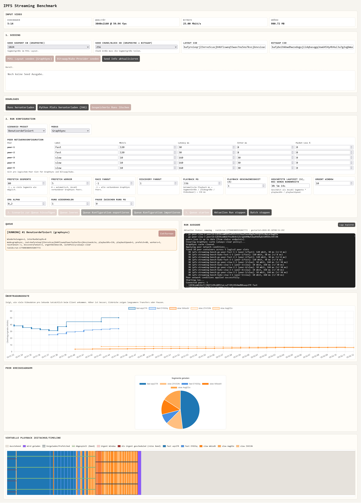

# IPFS Streaming Bench

Dieses Repository enthält eine Benchmark Umgebung für IPFS-basiertes Video-Streaming. Der Benchmark vergleicht einen eigenen GraphSync-Client mit adaptiver Peer-Auswahl gegen eine Boxo/Bitswap-Baseline. Ziel ist, ein Videostream Abruf unter dezentralen Bedingungen reproduzierbar zu simulieren. Dabei werden QoE und andere Metriken erhoben um so verschiedene Ansätze miteinander vergleichen zu können. 
## Table of Contents
- [IPFS Streaming Bench](#ipfs-streaming-bench)
  - [Table of Contents](#table-of-contents)
  - [Voraussetzungen](#voraussetzungen)
  - [Setup](#setup)
  - [Einen einzelnen Benchmark ausführen](#einen-einzelnen-benchmark-ausführen)
  - [UI-Parameter](#ui-parameter)
    - [Seeding](#seeding)
    - [Szenario und Run](#szenario-und-run)
  - [Ergebnisse und Analyse](#ergebnisse-und-analyse)
  - [Nützliche Befehle](#nützliche-befehle)
  - [Troubleshooting](#troubleshooting)
  - [Screenshot der Web-UI](#screenshot-der-web-ui)


Die Umgebung besteht aus:

- GraphSync-Client und GraphSync-Peers (`cmd/gs-client`, `cmd/gs-peer`)
- Boxo/Bitswap-Client als Baseline (`cmd/boxo-bitswap-client`)
- Seeder für das POSL-Layout, also das segmentierte DAG-Layout des Videos (`cmd/seed`)
- Docker-Compose-Topologie mit schnellen und langsamen Peers (`docker-compose.yml`, `docker/`)
- Web-UI zum Seeden, Konfigurieren und Starten von Runs (`cmd/benchmark-ui`, `ui/`)
- Plot- und CSV-Auswertung für exportierte Runs (`analysis/`)

## Voraussetzungen

Der Benchmark sollte auf einem nativen Linux-Host laufen. Eventuell funktioniert es auch auf MacOS, wurde aber nicht getestet. Die Netzwerkprofile werden mit `tc/netem` in den Containern gesetzt. Docker Desktop mit WSL2 erzeugt hierbei Fehler und kann nicht genutzt werden.

Nötig sind:

- Linux-Host mit Docker und Docker Compose
- Zugriff auf `/var/run/docker.sock` für die Benchmark-UI
- ein Video, das als `videos/input.mp4` im Repository liegt

Vor dem ersten Lauf sollten auf dem Docker Host die Host Netzwerkparameter gesetzt werden:

```bash
sudo bash scripts/setup-linux-host.sh
```

Das Skript setzt größere UDP-Socket-Buffer für libp2p/quic-go und bricht ab, wenn es WSL erkennt.

## Setup

1. Video ablegen:

```bash
mkdir -p videos
cp /pfad/zum/video.mp4 videos/input.mp4
```

Der Dateiname muss `input.mp4` sein, weil die Docker-Services diesen Pfad erwarten.

2. Docker-Images bauen:

```bash
docker compose build
```

3. Stack starten:

```bash
docker compose up -d
```

Der optionale `seed`-Service erzeugt denselben GraphSync/POSL-Seed-Pfad wie die UI: `/data/seed/manifest.json` und `/data/seed/blocks` im `graphsync-data` Volume.

4. Web-UI öffnen:

```text
http://localhost:54444
```

## Einen einzelnen Benchmark ausführen

Der normale Weg für einen einzelnen Run führt über die Web-UI.

1. Im Bereich für das Seeding die Werte wählen: GraphSync nutzt `Seed Segment KB` und `Seed Chunk KB`, Bitswap nutzt nur `Seed Block KB` bis maximal 1024 KB.
2. `Seed Info Aktualisieren` ausführen, um vorhandene Seed-Metadaten zu laden.
3. `POSL Layout seeden` ausführen. Falls die GraphSync-Peers beim ersten Mal noch neu starten oder das Manifest noch nicht sehen, den Schritt wiederholen, bis die UI einen erfolgreichen Seed meldet.
4. Für einen Bitswap-Run zusätzlich `Bitswap seeden` ausführen. GraphSync/POSL und Bitswap/Kubo verwenden unterschiedliche Roots; der Bitswap-Root wird in `/data/kubo_cid.txt` im gemeinsamen Kubo-Volume gespeichert.
5. Ein Szenario auswählen:
   - `graphsync-adaptive`: GraphSync mit adaptivem Scheduler, Prefetching, Racing und Durchsatzmessung.
   - `boxo-bitswap-trace`: Boxo/Bitswap-Baseline mit Trace-Auswertung.
   - `custom`: manuelle Parameterwahl.
6. Ein Netzwerkprofil wählen oder die Peer-Netzwerkwerte manuell setzen. Die Profile bilden unterschiedliche Bandbreiten, Latenzen, Jitter und Paketverlust ab.
7. Das Szenario zur Queue hinzufügen.
8. Die Queue starten.
9. Nach Abschluss die Ergebnisse in der UI herunterladen.


## UI-Parameter

### Seeding

| Parameter | Default | Beschreibung und Sonderfälle |
| --- | --- | --- |
| `Seed Segment KB (GraphSync)` | `1024` | Legt die Segmentgröße im POSL-Layout fest. Auswählbar sind `256`, `512`, `1024`, `2048`, `4096` und `8192` KB. |
| `Seed Chunk KB (GraphSync)` | `256` | Legt die Chunk-Größe innerhalb eines GraphSync-Segments fest. Erlaubt sind `256`, `512` und `1024` KB, aber nur wenn die Segmentgröße dadurch ohne Rest teilbar ist. |
| `Seed Block KB (Bitswap)` | `1024` | Legt die Chunk-Größe für den Kubo Bitswap-Seed fest. erlaubt sind `256`, `512` und `1024` KB, Werte über `1024` werden auf `1024` begrenzt. |

`Layout CID` und `Bitswap CID` sind reine Anzeigefelder für die zuletzt gefundenen oder erzeugten Root CIDs.

### Szenario und Run

| Parameter | Default | Beschreibung und Sonderfälle |
| --- | --- | --- |
| `Szenario Preset` | `Benutzerdefiniert` | Wählt eine vorbereitete Konfiguration; `GraphSync (adaptiver Scheduler)` setzt GraphSync-Parameter und sperrt den Modus, `Boxo Bitswap Baseline` schaltet auf Bitswap und sperrt den Modus. |
| `Modus` | `GraphSync` | Wählt den Client-Typ; `Bitswap` nutzt die Boxo/Bitswap-Baseline über Kubo-Provider. |
| `Netzwerk Preset` | `Benutzerdefiniert` | Befüllt die Peer-Netzwerkkonfiguration mit vorbereiteten Profilen wie heterogen, homogen, Bandbreitenstress oder Packet Loss aus der Masterarbeit |
| `Prefetch Segmente` | `-1` | Begrenzt die Anzahl der Segmente die der Graphsync Scheduler maximal prefetchen soll. `-1` bedeutet alle verbleibenden Segmente. |
| `Prefetch Worker` | `5` | Bestimmt die Zahl paralleler GraphSync Anfragen. 5 Bedeutet es werden maximal 5 Segmente gleichzeitig angefragt. `0` bedeutet die Anzahl verbundener GraphSync-Peers. |
| `Race Fanout` | `-1` | Bestimmt, wie viele GraphSync-Peers pro Race parallel angefragt werden; `-1` bedeutet alle verbundenen GraphSync-Peers. |
| `Discovery Fanout` | `2` | Begrenzt parallele nicht dringende Durchsatz Discovery Anfragen. Werte `<=0` deaktivieren die Discovery. |
| `Playback ms` | `40` | Legt die Abspielzeit pro Segment fest. Nach `Seed Info aktualisieren` wird der Wert automatisch aus Segmentgröße, Videogröße und Videodauer berechnet, solange er nicht manuell geändert wurde. |
| `Playback Geschwindigkeit (x)` | `1` | Skaliert die simulierte Abspielgeschwindigkeit. Die UI sendet einen entsprechend angepassten effektiven `playbackMs`-Wert an den Run. |
| `Urgent Window` | `10` | Legt die Anzahl der Segmente fest, die als dringend markiert werden. Beeinflusst die adaptive Peer-Auswahl. |
| `EMA alpha` | `0.2` | Glättungsfaktor für die GraphSync-Durchsatzschätzung. Höhere Werte reagieren stärker auf neue Messungen. |
| `Runs wiederholen` | `1` | Wiederholt diesen Run mehrfach. Minimum ist `1`. |
| `Pause zwischen Runs ms` | `0` | Wartet zwischen Wiederholungen oder Queue-Einträgen. Minimum ist `0`. |


## Ergebnisse und Analyse

Die Web-UI speichert Run-Daten als JSON und bietet Downloads für Runs, Plots und Timeline-Exporte an. Die persistenten Run-Daten liegen im Docker-Volume `runs-data`.

Für die Thesis-Plots kann ein Run-Export aus der UI mit dem Analyse-Skript verarbeitet werden, oder einfach per Web UI heruntergeladen werden:

```bash
python -m pip install -r analysis/requirements.txt
python analysis/plot_runs.py --input bench-runs.zip --out analysis/figures
```

Alternativ kann statt der ZIP-Datei ein Ordner mit Run-JSON-Dateien angegeben werden:

```bash
python analysis/plot_runs.py --input path/to/runs --out analysis/figures
```

Die Analyse erzeugt SVG-Abbildungen und CSV-Tabellen, unter anderem `runs_flat.csv`, `peers_flat.csv`, `scheduler_events.csv`, `bitswap_segment_readiness.csv` und `segment_lateness.csv`.


## Nützliche Befehle

Stack starten:

```bash
docker compose up -d
```

Logs der UI anzeigen:

```bash
docker compose logs -f benchmark-ui
```

Stack stoppen:

```bash
docker compose down
```

Stack inklusive Volumes löschen, wenn Seeds und Runs komplett neu erzeugt werden sollen:

```bash
docker compose down -v
```

## Troubleshooting

- `tc/netem` funktioniert nicht oder Netzwerkprofile wirken nicht: auf einem nativen Linux-Host ausführen. Docker Desktop mit WSL2 ist für diese Messungen nicht geeignet.
- `quic-go` meldet zu kleine UDP-Buffer: `sudo bash scripts/setup-linux-host.sh` ausführen und Container danach neu erstellen.
- Die UI meldet, dass `videos/input.mp4` fehlt: Datei exakt unter diesem Pfad ablegen und den Stack bei Bedarf neu starten.
- GraphSync-Peers finden den Seed nicht: `POSL Layout seeden` erneut ausführen oder die Container mit `docker compose up -d --force-recreate` neu erstellen.
- Ein Run verwendet alte Daten: Run- und Seed-Volumes mit `docker compose down -v` entfernen und danach neu bauen/starten.

## Screenshot der Web-UI
